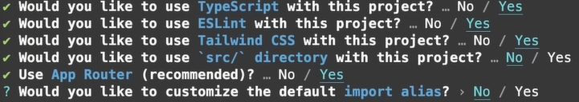
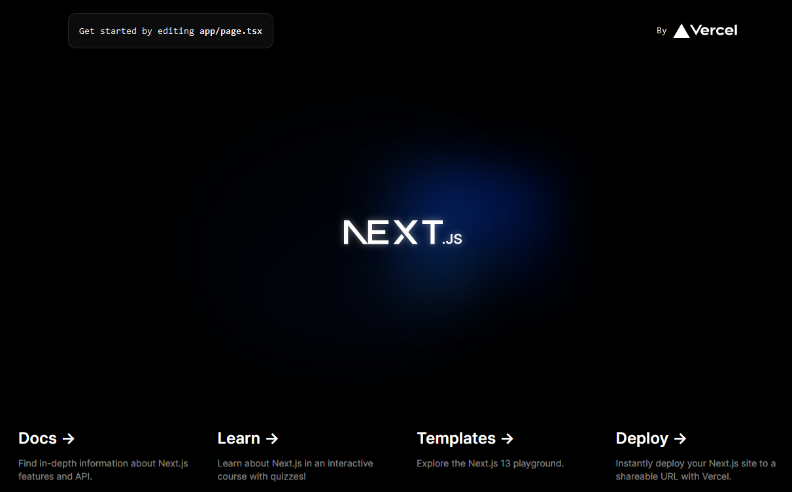

> **Note**
>
> The current site is live [here](https://jodadoj-spotify-clone-demo.netlify.app/).

# Creating a Spotify clone #

The source of this project comes from [Code with Antonio's](https://www.youtube.com/watch?v=2aeMRB8LL4o) incredibly helpful guide. This is mostly a written step-by-step to both record the process in another form and act as a revision tool.

## Contents

### [Getting Started](#getting-started)

### [1. Default Project](#default-project)

### [2. Changing Basic Layout](#changing-basic-layout)

### [3. Editing Routes](#editing-routes)

### [4. Adding Sidebar Details](#adding-sidebar-details)

### [5. Adding a Song Library](#adding-a-song-library)

### [6. Adding a Header](#adding-a-header)

### [7. Adding Our Own Custom Button](#adding-our-own-custom-button)

### [8. Populating the Page](#populating-the-page)

## Getting Started 

The original guide suggests using `npm` but I personally prefer `yarn` and so will be using that instead.

> **Note**
>
>  When talking about the actions of the reader and/or myself, we'll take to the habit of using pural pronouns like "we" or "our" except in the case that "I" am taking personal responsibility.

We use the command `yarn create next-app` with the argument `spotify-clone-next` and setting up with Typescript,ESLint,Tailwind and App Router enabled.



## Default Project

We can run the default project using the command `yarn dev`. Before we do this, we may choose to activate next.js' experimental [Turbopack](https://nextjs.org/docs/architecture/turbopack) to increase the speed of local develpoment.

This can be done by going to the `package.json` file under the `scripts` key and setting the value of the `dev` key to `next dev --turbo` rather thand the default `next dev`. 

```json
  "scripts": {
    "dev": "next dev --turbo",
    "build": "next build",
    "start": "next start",
    "lint": "next lint"
```

> **Note**
>
>  This is an optional and not fully supported/released beta functionality. It is only done for convienience and can be turned off if it doesn't seem to make a difference or is actively harmful.

In it's current state, the project is still the default Next.js project. 



To start, we delete everything in `app/page.tsx`'s return statement and place a single empty `<div>` in it's place. We also remove the import reference to the image file at the top.

> **Note**
>
>  Next.js App Router determines the url by the folder structure for convienience and universal understanding of where each page lies. 

By the deleting everything but a single div, we should be left with a blank black screen for our only page. 

At this point, we should write anything we want inbetween the div element as a placeholder/test for styling.

## Changing Basic Layout

Said styling is due to the `global.css` file in the `app` folder.

We delete everything unrelated/marked as tailwind as well and now the background is completely white. If We add any text to the div it should be a default font and black.


```ts
export default function Home() {
    return(
        <div></div>
    )
}
```

We edit the css to change the `html`, `body` and `:root` element settings to `height: 100%`, `background-color: black` and `color-scheme: dark` to change the text back to white and the background to black. 

We also delete everything in the `tailwind.config.js` extend object.

```css
@tailwind base;
@tailwind components;
@tailwind utilities;

html,
body,
:root {
  height: 100%;
  background-color: black;
  color-scheme: dark;
}
```

```js
/** @type {import('tailwindcss').Config} */
module.exports = {
  content: [
    './pages/**/*.{js,ts,jsx,tsx,mdx}',
    './components/**/*.{js,ts,jsx,tsx,mdx}',
    './app/**/*.{js,ts,jsx,tsx,mdx}',
  ],
  theme: {
    extend: {
    },
  },
  plugins: [],
}
```

And then change the font. This is controlled by the `layout.tsx` file in the `app` folder - namely the `inter` constant that imports the font `Inter` from the Next.js font repository. 

```ts
const figtree = Figtree({ subsets: ['latin'] })
```

Change the upppercase `Inter` reference to `Figtree` and the lowercase to `figtree` across the document.

We then return to the div text and edit the element. Add a `className=text-green-500` to the opening of the element. This is `Tailwind CSS`.

> **Note**
>
>  In VSCode, it's recomended to use the Tailwind CSS official extension to enable better Intellisense and quicker parsing of the `className=` options. This is, again, optional.

At this point, our text should be green and resemble the Spotify layout slightly more.

## Editing routes

We can now shut down our `localhost` server and create a new folder in `app` called `(site)`. 

> **Note**
>
> Using parentheses in Next.js folders notes that said folder will not be used to create a new route. Generally the folder names should be treated as actual variables - it should be assumed the names and their formatting is always important!

This is a [Route Group](https://nextjs.org/docs/app/building-your-application/routing/colocation#route-groups) used for organising the file structure. We now cut and paste the `page.tsx` file into the subfolder `(site)`. Edit the resulting file and run the server to check it works correctly.

Afterwards we create a folder called `components` in the root of the project. Inside  we create the `Sidebar.tsx` component. 

We diverge from the guide and create another new folder called `interfaces` and create a `SidebarProps.tsx` file inside of that.


`components/Sidebar.tsx`
``` ts
"use client"

import "../interfaces/SidebarProps"
import SideBarProps from "@/interfaces/SidebarProps"

const Sidebar:React.FC<SideBarProps> = ({children}) => {
    return(
        <div>
            {children}
        </div>
    )
}

export default Sidebar;
```

> **Note**
>
> The "use client" flag switches a component from a server component to a [client component](https://nextjs.org/docs/getting-started/react-essentials#client-components) in Next.js. This allows the page to take user input, remember state, etc in exchange for losing clear access to the server backend and secret keys.

`interfaces/SidebarProps.tsx`
``` ts
export default interface SideBarProps {
    children: React.ReactNode;
}
```

We then wrap the `children` prop in `layout.tsx` in a Sidebar.

```ts
    <html lang="en">
      <body className={figtree.className}>
        <Sidebar>{children}</Sidebar>
        </body>
    </html>
```

We essentially pass <em>server components</em> as <em>client components</em> in the sidebar.

## Setting up Sidebar

We import `usePathname` from `next/navigation` and `useMemo` from `react` into `Sidebar.tsx`. We define a constant `pathname` that takes `usePathname` as the argument, and another `routes` that takes a `useMemo` hook.

> **Note**
>
> [useMemo](https://react.dev/reference/react/useMemo) caches the result of larger operations to prevent subsequent large tasks taking place - it increase performance. [usePathname](https://nextjs.org/docs/app/api-reference/functions/use-pathname) is simply Next.js' ways of reading the pathname from a client component.

We shut down the server, as we will be doing another backend change, and use the terminal to `yarn add react-icons` then `yarn tailwind-merge` then add icons to the hook object like so:

`Sidebar.tsx`
```ts
    const pathname = usePathname();
    const routes = useMemo(() => [
        {
            icon: HiHome,
            label: 'Home',
            active: pathname !== '/search',
            href: '/'
        },
        {
            icon: BiSearch,
            label: 'Search',
            active: pathname === '/search',
            href: '/search'
        }
    ], [pathname]);
```

Making sure to import the correct icons from `react-icons/hi` and `react-icons/home` respectively. For reference, `active` will simply tell the client whether or not we are currently searching - the naming will become obvious soon.

We add the new components `Box.tsx` and `BoxProps.tsx` in the `components` and `interfaces` folders respectively

```ts
import { twMerge } from "tailwind-merge";
import BoxProps from "@/interfaces/BoxProps";

const Box: React.FC<BoxProps> = ({children, className}) => {
    return (
        <div className={twMerge(`
            bg-neutral-900
            rounded-lg
            h-fit
            w-full
        `, className)}>
            { children }
        </div>
    );
}

export default Box;
```

```ts
export default interface BoxProps {
    children: React.ReactNode;
    className?: string;
}
```

`Tailwind-merge` is used to enable Tailwind to better pass the classnames to instances of the `Box` component. The components are given default properties (background colour, round edges, size) and then, through the `classname` prop, can have additional propetries ammended.

We go back to `Sidebar.tsx` and import the `Box` component then add the following:

```ts
return(
        <div className="flex h-full">
            <div className="
            hidden
            md:flex
            flex-col
            gap-y-2
            bg-black
            h-full
            w-[300px]
            p-2
            "
            >
                <Box>
                    Sidebar Navigation  
                </Box>
                <Box>
                    Song Library 
                </Box>
            </div>
            {children}
        </div>
    )
}
```

This creates a a sidebar which is regularly hidden from mobile view (which can be checked with your inspect element) and takes two `Box` components then displays them like so:


> **Note**
>
>  The ratio of code explanation vs length decreases from here on with most text being `tailwindCSS` styling. The CSS choices are copied from the original video (and obviously Spotify) so there's no further justification or explanation of the UI/UX. The reader is directed to the [tailwind docs](https://v1.tailwindcss.com/components/navigation) for futher explanation and examples to learn more.

## Adding Sidebar Details

We now can start stylising our sidebar. We create a new file in `components` called `SidebarItem.tsx` and an interfaces in `interfaces` called `SidebarProps.tsx` to hold the individual iteams of the Sidebar. 

```ts
import { IconType } from "react-icons/lib";

export default interface SidebarItemProps {
    icon: IconType;
    label: string;
    active?: boolean;
    href: string;
}
```

`icon` will take the infomation loaded from `Sidebar.tsx` when we imported the `react-icons` earlier. `label` will take the name of the path specified. `active` will again tell us if the search is active. `href` will be the current route. This is the same as the arguments previously created.

We then import this into our other new file:

```ts
import SidebarItemProps from "@/interfaces/SidebarItemProps";
import Link from "next/link";
import { twMerge } from "tailwind-merge";

const SidebarItem: React.FC<SidebarItemProps> = ({
    icon: Icon, label, active, href
}) => {
    return (
        <Link
            href={href}
            className={twMerge(`
                flex
                flex-row
                h-auto
                items-center
                w-full
                gap-x-4
                text-md
                font-medium
                cursor-pointer
                hover:text-white
                transition
                text-neutral-400
                py-1
            `, active && "text-white"
            )}>
                <Icon size={26} />
                <p className="truncate w-full">{label}</p>
        </Link>
    );
}

export default SidebarItem;
```

Again using `twMerge` to take optional additional styling. There is a short-circuit to determine whether the text is white. It normally only becomes white when hovered but it also will when the search functionality is being used later.

Each item is a `Link` that takes us to the `href` value and has an `icon` - we turn `icon` into a component when importing - and a text `label`.

Returning to `Sidebar.tsx` We add the argument `className="overflow-auto h-full` to the Song Library box. This stretches the sidebar all the way to the bottom of the screen.

We then edit the Navigation box to include out `SidebarItem` components, mapping through the `routes` provided.

```ts
                <Box>
                    <div className="
                        flex
                        flex-col
                        gap-y-4
                        px-5
                        py-4
                        ">
                        {routes.map((item) => 
                        <SidebarItem key={item.label} {...item}/>
                        )}
                    </div>
                </Box>
```

## Adding a Song Library

Now we create a component called `library.tsx` and a corresponding `LibraryProps.tsx` in the usual folders. The interface will be empty for now.

`Library.tsx` will be a client component and so we add `"use client"` to the top of the file before we import our interface. We add a placeholder `onClick` before the return statement for when we're adding later functionality. The rest is stylising besides adding in a `TbPlaylist` icon and `AiOutlinePlus` icon with similar properties to the ones in the top of the sidebar. These can be seen below:

```ts
"use client"

import LibraryProps from "@/interfaces/LibraryProps";
import {TbPlaylist} from "react-icons/tb";
import {AiOutlinePlus} from "react-icons/ai";

const Library: React.FC<LibraryProps> = () => {
    const onClick = () => {};
    return(
        <div className="flex flex-col">
            <div className="
            flex
            items-center
            justify-between
            px-5
            pt-4
            ">
                <div className="
                inline-flex
                items-center
                gap-x-2">
                    <TbPlaylist size={26} className="
                    text-neutral-400"/>
                    <p className="
                    text-neutral-400
                    font-medium
                    text-md">
                        Your Library
                    </p>
                </div>
            <AiOutlinePlus 
            onClick={onClick}
            size={20}
            className="
            text-neutral-400
            cursor-pointer
            hover:text-white
            transition"/>
            </div>
            <div className="
            flex
            flex-col
            gap-y-2
            mt-4
            px-3
            ">
                List of songs
            </div>
        </div>
    )
}

export default Library;
```

```ts
export default interface LibraryProps {
    
}
```

And add this to the Song Library `Box` in `Sidebar.tsx:

```ts
                <Box className="overflow-y-auto h-full">
                    <Library></Library> 
                </Box>
```
We should have a sidebar that looks like this:


## Adding a Header 

Below the above we change our main element to have the attributes

```ts
            <main className="
            h-full
            flex-1
            overflow-y-auto
            py-2">{children}</main>
```

Then we create a `Header.tsx` and `HeaderProps.tsx` in our usual folders. The props will be the exact same as our `BoxProps.tsx` file except for the name. 

The `Header.tsx` file will be a client component. We import or props and pass them down (again, identical to `Box.tsx`) and before the return value declare a two hooks: `router` and `handleLogout`. 
```ts
"use client"

import HeaderProps from "@/interfaces/HeaderProps";
import { useRouter } from "next/navigation";
import { twMerge } from "tailwind-merge";

const Header: React.FC<HeaderProps> = ({children, className}) => {
    const router = useRouter();
    const handleLogout = () => {};
    return (
        <div></div>
        )
};

export default Header;
```

Inside the return statement we create two nearly identical buttons surrounded by divs with the imported icons `RxCaretLeft` and `RxCaretRight` from `react-icons/rx`. These have the `onClick` functionality to bring the above `router` back and forth through out pages.

```ts
    return(
        <div className={twMerge(`
        h-fit
        bg-gradient-to-b
        from-emerald-800
        p-6`,
        className)}>
            <div className="
            w-full
            mb-4
            flex
            items-center
            justify-between
            ">
                <div className="
                hidden
                md:flex
                gap-x-2
                items-center">
                    <button 
                    onClick={(e) => router.back()}
                    className="
                    rounded-full
                    bg-black
                    flex
                    items-center
                    justify-center
                    hover:opacity-75
                    transistion">
                        <RxCaretLeft className="text-white" size={35}/>
                    </button>
                    <button 
                    onClick={(e) => router.forward()}
                    className="
                    rounded-full
                    bg-black
                    flex
                    items-center
                    justify-center
                    hover:opacity-75
                    transistion">
                        <RxCaretRight className="text-white" size={35}/>
                    </button>
                </div>
            </div>
        </div>
    )
```

We then activate mobile view in inspect element on our local server to see the next part. We add a div before the second to last (on the same level as the div holding our first buttons) with the familiar `BiSearch` and `HiHome` icons:

```ts
                <div className="
                flex
                md:hidden
                gap-x-2
                items-center">
                    <button 
                    className="
                    rounded-full
                    p-2
                    bg-white
                    flex
                    items-center
                    justify-center
                    hover:opacity-75
                    transition">
                        <HiHome className="text-black" size={20} />
                    </button>
                    <button 
                    className="
                    rounded-full
                    p-2
                    bg-white
                    flex
                    items-center
                    justify-center
                    hover:opacity-75
                    transition">
                        <BiSearch className="text-black" size={20} />
                    </button>
                </div>
```

To give this result:


## Adding Our Own Custom Button

We create another component this time called `Button` with the usual components and structure. This time our interface will extend an already existing type `React.ButtonHTMLAttributes`.

```ts
export default interface ButtonProps 
extends React.ButtonHTMLAttributes<HTMLButtonElement>{
}
```

In this we just take a regular HTML button and pass down props and some default styling:

```ts
import { forwardRef } from "react";
import ButtonProps from "@/interfaces/ButtonProps";
import { twMerge } from "tailwind-merge";

const Button = forwardRef<HTMLButtonElement, ButtonProps>(({
    className,
    children,
    disabled,
    type= "button",
    ...props
    }, ref) => {
        return(
            <button
            type={type}
            className={twMerge(`
            w-full
            rounded-full
            bg-green-500
            border
            border-transparent
            px-3
            py-3
            disabled:cursor-not-allowed
            disabled:opacity-50
            text-black
            font-bold
            hover:opacity-75
            transition
            `, className)}
            disabled={disabled}
            ref={ref}
            {...props}
            >
                {children}
            </button>
        );
    })

Button.displayName = "Button";

export default Button;
```

We then add the `Button` in our `Header.tsx` inline with the previous divs yet again:

```ts
<div className="
    flex
    justify-between
    items-center
    gap-x-4
    ">
        <>
            <div>
                <Button>
                    Sign up
                </Button>
            </div>
        </>
    </div>
```

Which looks like this:


We then return to `Header.tsx` and implement our `Button`. 

```ts
<div className="
                flex
                justify-between
                items-center
                gap-x-4
                ">
                    <>
                        <div>
                            <Button
                            onClick={(e)=>{}}
                            className="
                            bg-transparent
                            text-neutral-300
                            font-medium
                            ">
                                Sign up
                            </Button>
                        </div>
                        <div>
                            <Button
                            onClick={(e)=>{}}
                            className="
                            bg-white
                            px-6
                            py-2
                            ">
                                Log in
                            </Button>
                        </div>
                    </>
                </div>
```

We use an extra div as a placeholder for when there is a log in and out functionality. The `onClick` events still lead nowhere for the same reason.

## Populating the Page

We create a `ListItem.tsx` and `ListItemProps.tsx` file. In the interface we define an `image`, `name` and `href` sttribute to be passed down. Note that `image` refers to the url of the image being used as an icon here.

```ts
export default interface ListItemProps {
    image:string;
    name:string;
    href:string;
}
```

We pass those props down to our `ListItem` and define an `onClick` and `router` hook for future use - this means we begin the file with `"use client"` yet again. We define a generic `button` which uses the `onClick` import the `Image` component from `next/navigation` and pass the `name` attribute down in a p tag. Finally we import `FaPlay` from `react-icons/fa` and use it to create an active button that scaled on hover.

```ts
"use client";

import ListItemProps from "@/interfaces/ListItemProps";
import { useRouter } from "next/navigation";
import Image from "next/image";
import {FaPlay} from "react-icons/fa"

const ListItem:React.FC<ListItemProps> = ({image, name, href}) => {
    const router = useRouter();

    const onClick = () => {router.push(href);}

    return(
            <button 
                onClick={onClick}
                className="
                relative 
                group 
                flex 
                items-center 
                rounded-md 
                overflow-hidden 
                gap-x-4 
                bg-neutral-100/10 
                cursor-pointer 
                hover:bg-neutral-100/20 
                transition 
                pr-4
            ">
                <div className="
                relative
                min-h-[64px]
                min-w-[64px]
                ">
                    <Image 
                    className="object-cover"
                    fill
                    src={image}
                    alt="Image"
                    />
                </div>
                <p className="
                font-medium 
                truncate 
                py-5
                ">
                    {name}
                </p>
                <div className="
                    absolute 
                    transition 
                    opacity-0 
                    rounded-full 
                    flex 
                    items-center 
                    justify-center 
                    bg-green-500 
                    p-4 
                    drop-shadow-md 
                    right-5
                    group-hover:opacity-100 
                    hover:scale-110
                ">
                    <FaPlay className="text-black "/>
                </div>
            </button>
    );
}

export default ListItem;
```

We can go back to `page.tsx` and add this element and some more headers:

```ts
export default function Home() {
  return (
    <div className="
    bg-neutral-900
    rounded-lg
    h-full
    w-full
    overflow-hidden
    overflow-y-auto
    ">
      <Header>
        <div className="mb-2">
          <h1 className="
          text-white
          text-3xl
          font-semibold">
            Welcome back
          </h1>
          <div className="
          grid
          grid-cols-1
          sm:grid-cols-2
          xl:grid-cols-3
          2xl:grid-cols-4
          gap-3
          mt-4
          ">
            <ListItem 
            image="/images/liked.png"
            name="Liked Songs"
            href="liked"
            />
          </div>
        </div>
      </Header>
      <div className="
      mt-2 
      mb-7 
      px-6"
      >
        <div className="
        flex 
        justify-between 
        items-center
        ">
          <h1 className="
          text-white 
          text-2xl 
          font-semibold"
          >
            Newest Songs
          </h1>
        </div>
        <div>
          Song List
        </div>
      </div>
    </div>
  )
}
```

Leaving us with this:


